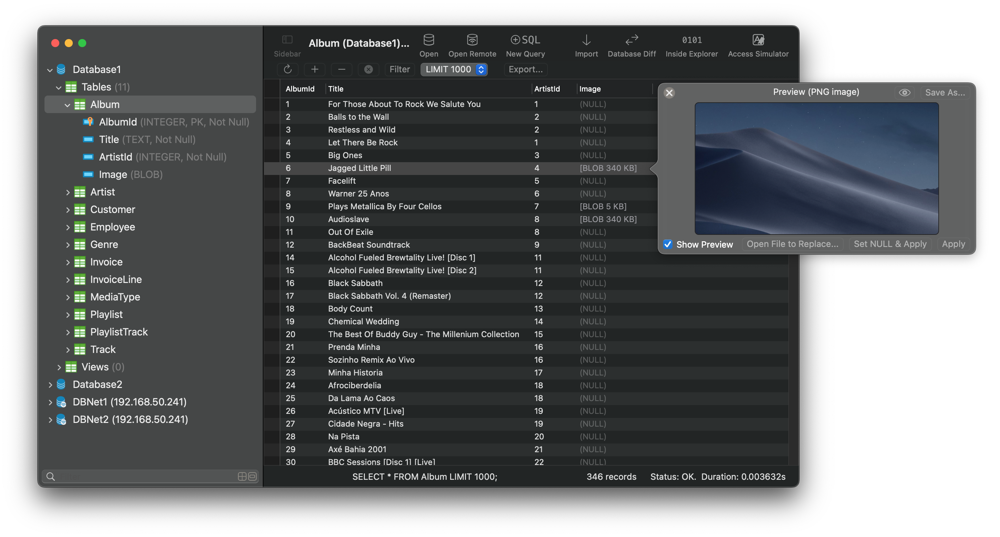

## Introduction
SQLiteFlow is an SQLite editor for Mac & iOS which is intuitive, stable and reliable to use.

## Platform
macOS 14.0+ / [iOS 18.0+](iOS)

## Download
Version 6.7.7 | Dec 24, 2025 | <a href="ReleaseNotes" target="_blank">Release Notes</a>
  

## Features

**Query Editor**

- Multi-query execution.
- Customize syntax highlighting.
- SQL auto-completion.
- Format query.
- Copy query as code.
- Paste recent query sessions.
- Explain query.

*Query Editor*

**Data Editor**

- View, edit or add table data.
- View table data with a convenient data filter.
- Edit blob data as hex or show it as preview if possible.
- Edit JSONB as JSON.
- Copy data to CSV，JSON, Markdown, and to Insert Statement or Update Statement if possible.

*Data Editor*

**Table Schema**

- View, edit or add table fields, indexes, foreign keys, checks.
- View triggers.
- View DDL.
- Preview the query that for altering table.

*Alter Table - Fields*

*Alter Table - Preview*

**Import**
- Supports import CSV data to a table.
- Supports import JSON data to a table.
- Supports import data by SQL file.

*Import*

**Export**
- In Data Editor or Query Results, supports export data to CSV, JSON or Markdown.
- In Data Editor, supports export data to Insert Statement or Update Statement if possible.

**Database Statistics**
- Display table counts and each table's record count.
- Display total size of each table, size of each table's content and size of each table's indexes.

*Database Statistics*

**ER Diagram**
- Supports toggle field type hide or show.
- Supports Relationship Guessing.
- Supports copy as Mermaid markdown.

**Database Diff**
- Supports generate SQL text that can let you transform a database into another.
- Supports show a summary of the differences between two databases.

**Remote Connect**
- Supports open remote SQLite database in iPhone or iPad with SQLiteFlow(iOS) installed. One use case is that you can debug query performance issue on your iPhone or iPad directly through your Mac.

*Remote Connect*

**Dark Mode**
- Supports Dark Mode for macOS 10.14+.

**Attach Database**
- Attach opened databases without any code. This is a very handy way to do attach database thing, and could save a lot of your time from writing ATTACH DATABASE commands if your business mode relies on it.

*Attach Opened Databases*

**Drag and Drop**
- Drag and drop to open databases and sql scripts.
- Create multiple windows.

**Inside Explorer**
- Show inside data structure of SQLite database file, journal file, WAL file and WAL-Index file.

*Inside Explorer*

**Access Simulator**
- Supports access Apple simulator. So you can open your app's Documents directory more easily than before when developing your apps.

**Handle Database File Name or Directory Changes**
- One of a cool thing that benefit from this feature is, this makes SQLiteFlow can work friendly with your SQLite databases in iOS simulator.

**Database Encryption**
- Supports handle encrypted SQLite databases which are encrypted by SQLCipher library.

**Shortcuts**
- Supports "Run Query" action.
- Supports "Import CSV" action.
- Supports "Import JSON" action. (Requires macOS 14.0 or later.)

**Load Extension**
- Supports SQLite load extension.

**LLDB Co-worker**
- Supports sfopen command. Let you open a copy of a temporary local database that originally in debugged device.
- Supports sfsave command. Let you copy the temporary local database (that originally created by sfopen command) to debugged device.

**Languages**
- English \| [简体中文 (Chinese, Simplified)](/zh-Hans) \| [繁體中文 (Chinese, Traditional)](/zh-Hant) \| [日本語 (Japanese)](/ja)

## Support or Contact
Have any questions or feature requests? Please feel free to <a href="https://github.com/SQLiteFlow/SQLiteFlow-Issues/issues" target="_blank">create an issue</a>.

