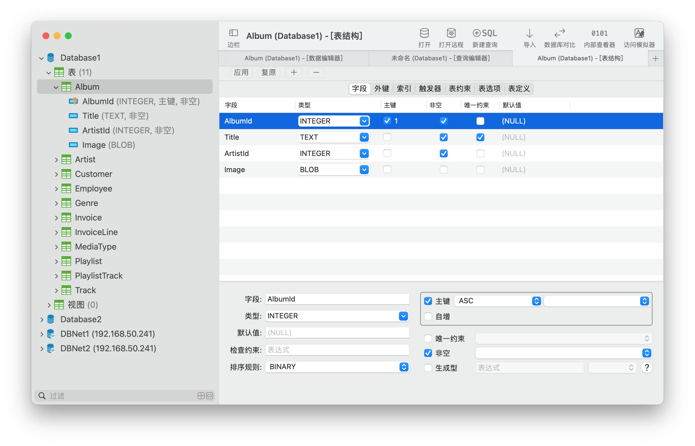
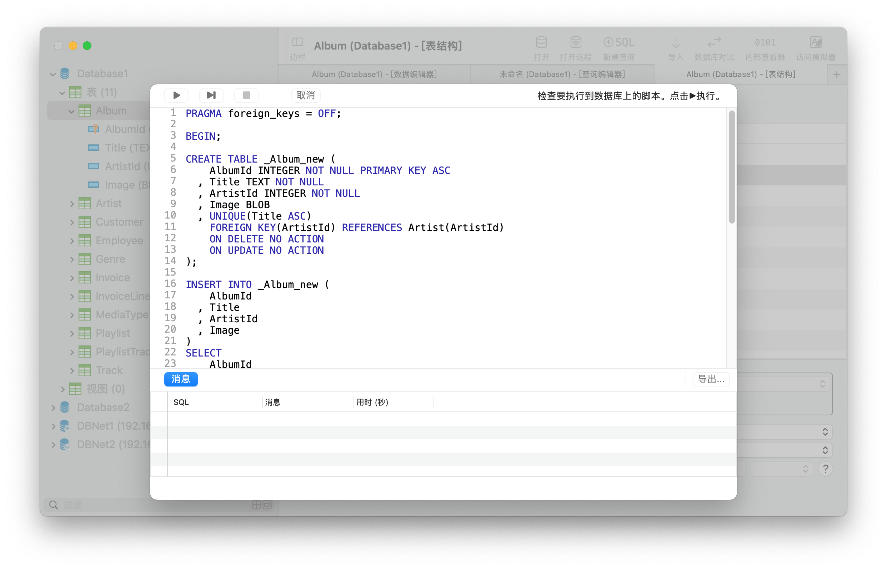
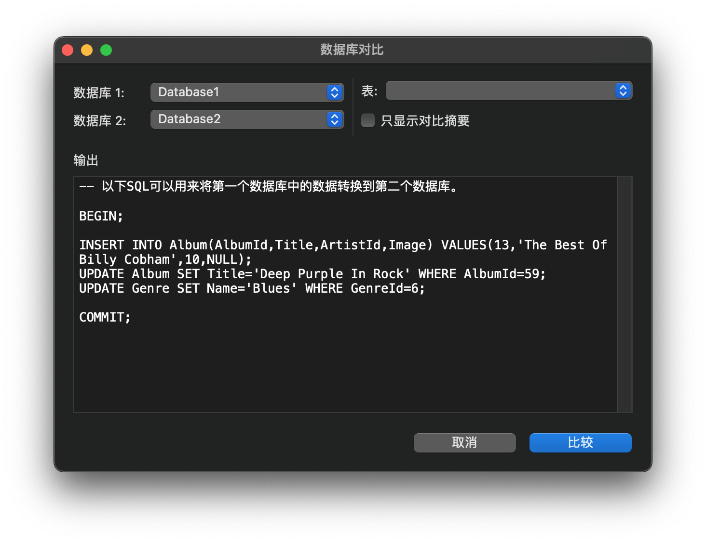
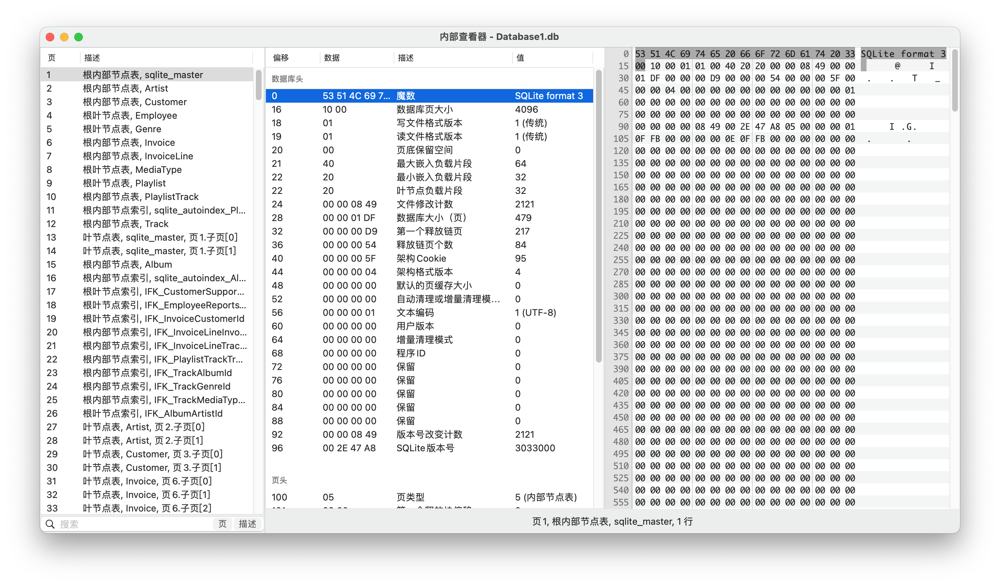

## SQLiteFlow
SQLiteFlow是为Mac和iOS平台开发的直观，稳定和易用的SQLite编辑器。

## 支持平台
macOS 13.0+ / [iOS 17.0+](iOS)

## 下载
版本 6.5.3 | 2024-11-27 | <a href="ReleaseNotes" target="_blank">更新日志</a>
  

## 功能

**SQL编辑器**

- 支持多SQL执行。
- 自定义语法高亮。
- SQL代码自动补全。
- 格式化查询。
- 自定义风格拷贝查询。
- 粘贴最近使用查询会话。
- 解释查询。

*SQL编辑器 - 支持多SQL执行。*

*SQL编辑器- 自定义风格拷贝查询与它的设置页面。*

**数据编辑器**

- 查看，编辑，添加和删除数据。
- 数据过滤器。
- 以十六进制编辑BLOB数据，如果可能，支持将其显示为预览。
- 以JSON来编辑JSONB。
- 拷贝数据到CSV，JSON, Markdown。如果可能的话，还可以到Insert语句或者Update语句。

*数据编辑器*

**修改表结构**

- 查看，编辑和添加表字段，索引，外键，唯一约束和检查约束。
- 查看触发器。
- 查看表定义。
- 预览修改表结构的SQL。

*修改表结构 - 修改字段*

*修改表结构 - 预览修改*

**导入**
- 支持导入CSV数据。
- 支持导入JSON数据。
- 支持导入SQL文件。

*导入文本*

**数据库统计**
- 显示表数和表中的记录数。
- 显示每个表的占用空间，及每个表中数据占用的空间和和索引占用的空间。

*数据库统计*

**ER图表**
- 支持切换字段类型显示状态。
- 支持开启关联猜测。
- 支持拷贝到Mermaid markdown。

**数据库比较**
- 支持生成使一个数据库转为另一个数据库SQL语句。
- 支持只显示两个数据库之间的不同的摘要信息。

**远程连接**
- 支持远程连接在SQLiteFlow(iOS)中的数据库。

*远程连接*

**深色模式**
- 在macOS 10.14+中支持深色模式。

**附加数据库**
- 无需任何代码，即可附加数据库，帮您省下很多写ATTACH DATABASE命令的时间。

*附加已打开的数据库*

**拖拽**
- 支持用拖拽操作来打开数据库和SQL脚本文件。
- 创建多窗口。

**内部查看器**
- 查看SQLite数据库文件，日志文件，WAL文件或者WAL-索引文件的内部结构。

*内部查看器*

**访问模拟器**
- 支持访问苹果模拟器。这样你在开发你们的App时，就可以更方便地打开你们的App的Documents目录了。

**自动处理数据库文件名或者路径变化**
- 经此获益的一个有意思的事情是，这使得SQLiteFlow在对处理在iOS模拟器中的数据库时显得很友好。

**数据库加密**
- 支持处理经SQLCipher库加密的数据库。

**捷径**
- 支持“执行查询”操作。
- 支持“导入CSV”操作。
- 支持“导入JSON”操作。(需要macOS 14.0+支持。)

**加载拓展**
- 支持加载SQLite拓展。

**LLDB协作**
- 支持sfopen命令。让您能够打开一个从被调试设备拷贝到本地的临时数据库。
- 支持sfsave命令。 让您能够拷贝一个临时数据库（最初被sfopen命令创建）到被调试设备。

**语言**
- [English](/) \| 简体中文 (Chinese, Simplified) \| [繁體中文 (Chinese, Traditional)](/zh-Hant) \| [日本語 (Japanese)](/ja)

## 联系我们
有问题或者新需求? 请到这里来<a href="https://github.com/SQLiteFlow/SQLiteFlow-Issues/issues" target="_blank">创建一个新Issue</a>。

